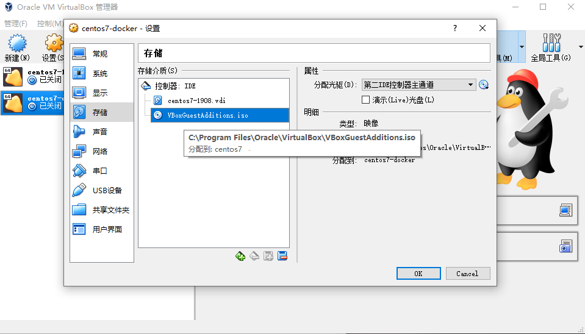
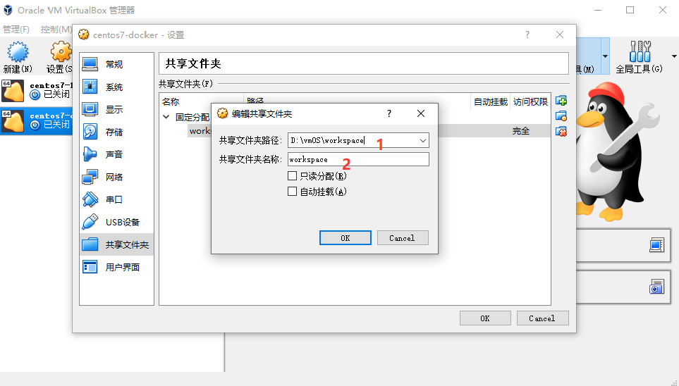

## 1 主机与虚拟机共享文件夹配置
1. VirtualBoxs安装软件对虚拟机 centos增强共享文件夹功能，需要手动挂载VBoxGuestAdditions.iso文件并安装

2. 以root账号登录centos执行下列命令

```bash
# 1为了避免安装出错，安装前置依赖
yum -y install kernel kernel-devel kernel-headers bzip2
# 2挂载iso文件到/mnt/cdrom
mkdir /mnt/cdrom
mount /dev/cdrom /mnt/cdrom
# 3安装VBoxLinuxAdditions
cd /mnt/cdrom
sh ./VBoxLinuxAdditions.run

# 安装完成
    VirtualBox Guest Additions: Look at /var/log/vboxadd-setup.log to find out what went wrong
    VirtualBox Guest Additions: Running kernel modules will not be replaced until the system is restarted
    VirtualBox Guest Additions: Starting.
# 4重启
reboot
```

3. 设置共享目录

```bash
# 1创建windows工作目录  D:\vmOS\worksapce,共享文件夹名称为worksapce，固定挂载
```

```bash
# 2以root登录centos输入以下命令
mkdir /mnt/win-workspace
mount -t vboxsf workspace /mnt/win-workspace
# 3进入/mnt/win-workspace,创建 a.txt文件
cd /mnt/win-workspace
touch a.txt
```
3. 检查windows共享目录 D:\vmOS\worksapce是否出现a.txt

   如果以上步骤没有出错， D:\vmOS\worksapce文件夹下已经出现a.txt
   

