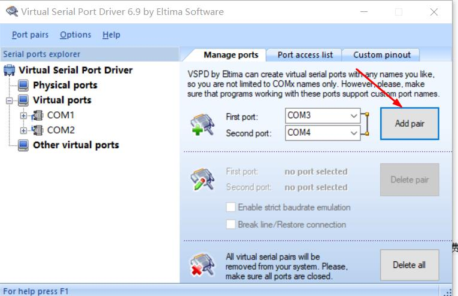
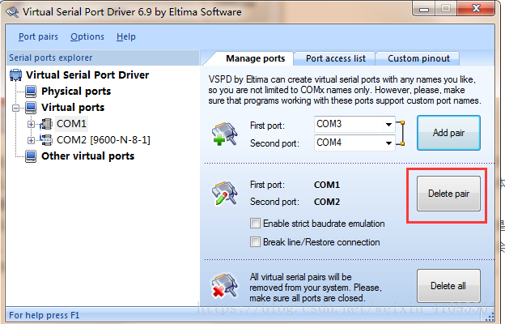

## 1 软件介绍
Virtual Serial Port Driver简称VSPD，是win平台虚拟串口工具。

## 2 软件安装设置

**1.安装**

- 解压文件，在`tool`目录vspd6.9。
- 安装vspd.exe。
- 进入Cracked目录，运行vspdconfig.exe。

**2.使用**
直接点击添加端口。
说明：vspd是以串口对形式添加的，比如这里COM1，COM2成对，那么COM1的数据就只能发到COM2，COM2会自动接收COM1发送的数据。

**3.使用完后记得删除端口**

注意：删除虚拟串口，一定要在在程序里删除。添加端口下有个 “删除端口“。

