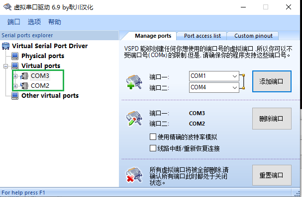
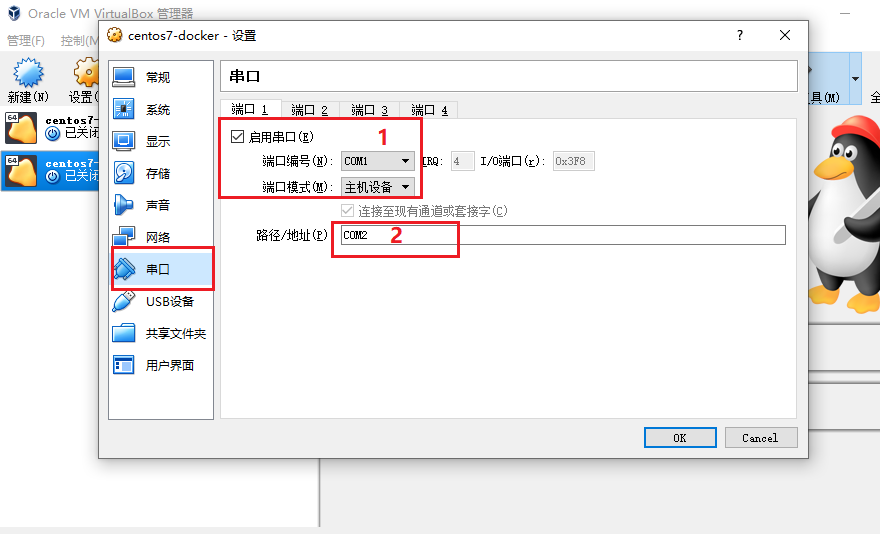
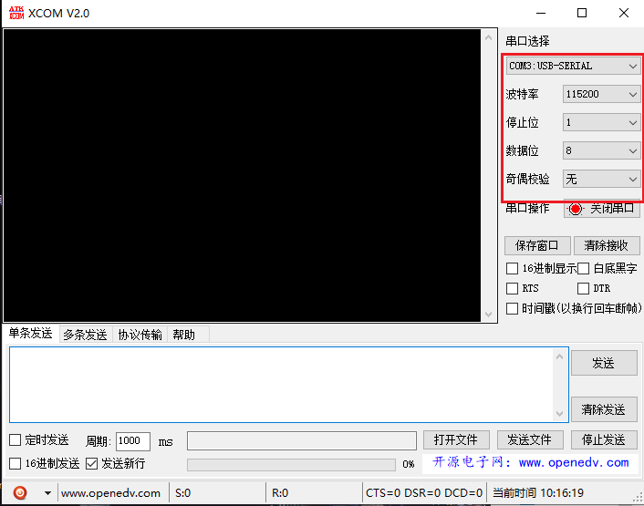
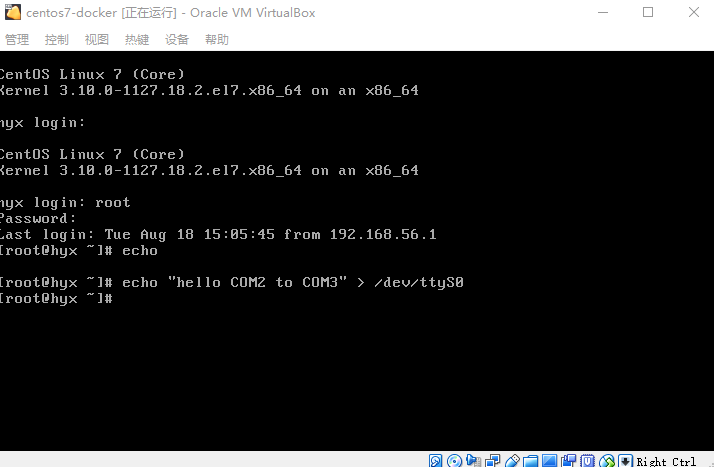
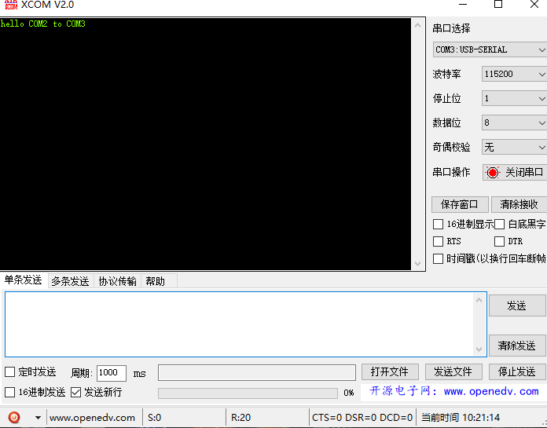

## 1 主机与虚拟机共享串口配置

- 通过vspd创建一对串口COM2和COM3。

- COM2共享给centos虚拟机。

	1. COM1在centos里对应的是`/dev/ttyS0`。
	2. COM2是win下虚拟串口COM2

​	至此win和虚拟机centos之间的串口共享配置完成，下面启动centos，即可进入虚拟机验证。

## 2 测试互通
- 用串口软件打开win下COM3

- 登录centos输入指令 `echo "hello COM2 to COM3" > /dev/ttyS0`

- win下串口软件应该会输出字符串 `hello COM2 to COM3`
